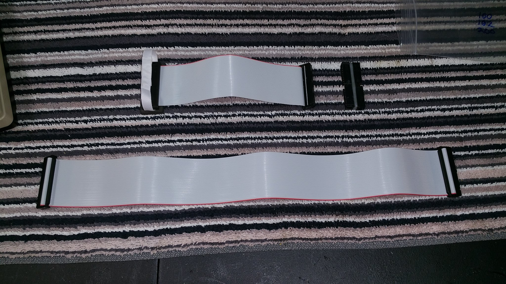

# 3-part Cable for TRS-80 Disk/Video Interface

Pics: https://photos.app.goo.gl/Jy1hXhc3aSbkcaFr6  
Parts: [DigiKey](https://www.digikey.com/short/22hnb0rh)  
Optional soldering helper PCB: https://oshpark.com/shared_projects/EoeBHp2k  
Ribbon for connector-pull: https://www.target.com/p/orange-birthday-ribbon-spritz-8482/-/A-86900836

This cable kit supports all 3 computer models that the Disk/Video Interface supports.
* TRS-80 Model 100  
Use all 3 parts connected together.
Plug the Model 100 adapter cable into the bus connector socket with the cable going directly towards the rear of the computer without having to fold back over the top of the bus connector.
The red stripe should be towards the battery compartment.

* TANDY Model 102 or 200
Use just the main cable and twist adapter connected together.

Aside from the Model 100 bus connector, all connections are polarity protected and can't be accidentally connected the wrong way.

On the D/V-I, The connector is on the underside of the box near the front. the plug must be pressed firmly enough to cause the two latches to snap closed.

## Part 1 - Main Cable  
Take one of the 2 pre-made cables and put it to the side. This is the main cable and will be used unmodified later.

## Part 2 - Twist Adapter  
Solder the 2 narrow 40-pin pin headers to each other, back to back, with the polarity notches on opposite sides from each other. One connector notch-up, the other connector notch-down.  

This will make pin #1 on one connector go to pin #2 on the opposite connector. This is correct.  

Optionally use the soldering helper pcb for this if you want. It's not needed, but it is easier.  

Optionally cover the pins with hot-glue and fill the gab between the connectors.  

It's called the twist adapter because it has the same effect as seperating all 40 wires into 20 pairs, and then giving each pair 1/2 twist.

## Part 3 - Model 100 Adapter
Take the remaining pre-made cable and cut it in half, so that each half is about 8 to 9 inches long.

Discard one half. If both halves are not identical, keep the one that has the cable on the opposite side from the polarity bump on the connector.  
If both do, or neither does, just pick either one to use.

Crimp the IDC-40 connector onto the cut end of the cable with the pins on the same side of the cable as the polarity bump on the other end of the cable.  
IE: Lay the cable out flat with the red stripe up and the polarity bump up.  
Insert the cut end of the cable into the DIP-40 connector with the pins pointing up.  
Crimp the DIP-40 connector using a small hobby vice, and ideally some wood blocks to spread the pressure and protect the pins.  

Take an 8 inch length of 3/8" strong fabric ribbon and hot-glue one end of the ribbon to the bottom of the DIP-40 connector in between the pins. Cover the whole bottom and press it flat before it cools.  
Loop the ribbon over the top and glue the other end to the bottom to form a closed loop.  
Don't just make a loop by gluing the the ribbon to itself. It's important that the loop is also fixed to the connector and the connector can't move or slide along the ribbon.  

Constructing the pull loop this way ensures that when you pull the DIP-40 out of the bus connector socket, the connector does not tip and bend the pins when the connector breaks free from the socket.  The closed loop and fixed attachement forces the connector to remain level even though you are not pulling perfectly straight.
